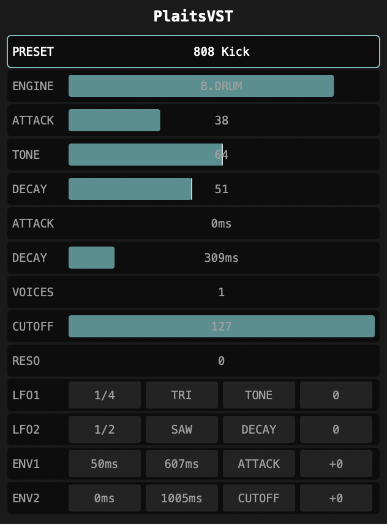

# PlaitsVST

A VST3/AU plugin that brings the [Mutable Instruments Plaits](https://mutable-instruments.net/modules/plaits/) macro-oscillator to your DAW.

## Features

- **16 Synthesis Engines** - Virtual Analog, FM, Wavetable, Granular, Additive, Physical Modeling, Speech, Drums, and more
- **Polyphonic** - Up to 16 voices with intelligent voice allocation
- **Modulation System** - 2 tempo-synced LFOs and 2 AD envelopes with flexible routing
- **Moog-style Filter** - 4-pole ladder filter with cutoff and resonance
- **Preset System** - Save and recall your patches
- **Tracker-style UI** - Compact, keyboard-navigable interface

## Downloads

Download the latest release for your platform:

| Platform | Format | Download |
|----------|--------|----------|
| **macOS** | VST3 | [PlaitsVST-macOS-VST3.zip](https://github.com/masseyis/plaits-vst/releases/latest/download/PlaitsVST-macOS-VST3.zip) |
| **macOS** | AU | [PlaitsVST-macOS-AU.zip](https://github.com/masseyis/plaits-vst/releases/latest/download/PlaitsVST-macOS-AU.zip) |
| **Windows** | VST3 | [PlaitsVST-Windows-VST3.zip](https://github.com/masseyis/plaits-vst/releases/latest/download/PlaitsVST-Windows-VST3.zip) |
| **Linux** | VST3 | [PlaitsVST-Linux-VST3.zip](https://github.com/masseyis/plaits-vst/releases/latest/download/PlaitsVST-Linux-VST3.zip) |

[View all releases](https://github.com/masseyis/plaits-vst/releases)

## Installation

### macOS
1. Download and unzip the VST3 or AU file
2. Copy to:
   - **VST3**: `~/Library/Audio/Plug-Ins/VST3/`
   - **AU**: `~/Library/Audio/Plug-Ins/Components/`
3. Rescan plugins in your DAW

### Windows
1. Download and unzip the VST3 file
2. Copy to: `C:\Program Files\Common Files\VST3\`
3. Rescan plugins in your DAW

### Linux
1. Download and unzip the VST3 file
2. Copy to: `~/.vst3/`
3. Rescan plugins in your DAW

## Usage

### Keyboard Navigation
- **Up/Down** - Select row
- **Left/Right** - Adjust value
- **Shift+Left/Right** - Adjust value in larger steps
- **Tab/Shift+Tab** - Navigate fields in modulation rows
- **S** - Save preset

### Synthesis Engines

| Engine | Description |
|--------|-------------|
| VA | Virtual Analog with saw, square, and sub oscillators |
| WAVSHP | Waveshaper with wavefolding |
| FM | 2-operator FM synthesis |
| GRAIN | Granular formant oscillator |
| ADDTIV | Additive synthesis with harmonic control |
| WAVTBL | Wavetable synthesis |
| CHORD | Chord generator with inversions |
| SPEECH | Speech synthesis (SAM-style) |
| SWARM | Swarm of detuned oscillators |
| NOISE | Filtered noise with clock |
| PARTCL | Particle/dust generator with reverb |
| STRING | Physical modeled string |
| MODAL | Modal/resonator synthesis |
| B.DRUM | Bass drum synthesis |
| SNARE | Snare drum synthesis |
| HI-HAT | Hi-hat synthesis |

### Modulation

Each modulation source (LFO1, LFO2, ENV1, ENV2) can target:
- **Harmonics/Timbre/Morph** - Engine-specific parameters
- **Cutoff/Resonance** - Filter parameters
- **LFO Rate/Amount** - Cross-modulation (LFOs can modulate each other)

## Source Code

PlaitsVST is open source. View the code on [GitHub](https://github.com/masseyis/plaits-vst).

## Credits

- [Mutable Instruments](https://mutable-instruments.net/) - Original Plaits DSP code (MIT License)
- [JUCE](https://juce.com/) - Audio plugin framework

## License

GPL v3 - See [LICENSE](https://github.com/masseyis/plaits-vst/blob/main/LICENSE) for details.
